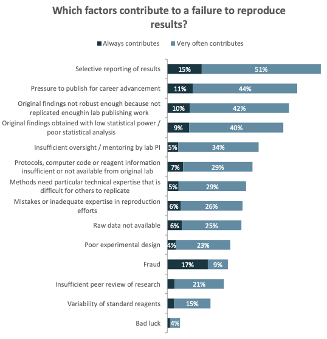

## Replication crisis (?)---roadmap

\begin{columns}
\begin{column}{.5\textwidth}
	\begin{center}
			\includegraphics[width = \textwidth]{../fig/replication_crisis}
	\end{center}
    \end{column}
    \begin{column}{.5\textwidth}
        \begin{itemize}
            \item Why bother?\newline
            \item Tools for organisation?\newline
            \item How to document?\newline
            \item Script \alert{everything}. No, really!\newline
            \item Versioning
        \end{itemize}
    \end{column}
\end{columns}

## Reproducibility in the \alert{social} sciences

- In the social sciences few attention to what workflow to use (and why)

- more emphasis on \alert{transparency}

    - scripts, data & additional analyses should be openly shared
    
- Increasing use of (large) datasets in the social sciences

    - more positivist & deductionist approach
    - more tools readily available
    
- Related work \citet{healyChoosingYourWork2011,  gandrudReproducibleResearchStudio2013,arribas-belWooWIIWorkshopOpen2015}

## \alert{Why}? Keeping \alert{sanity}

Because projects involve:

\begin{itemize}
\item whilst \alert{supervisor/referee} not satisfied
\begin{itemize}
\item whilst \alert{you} are not satisfied
\begin{enumerate}
\item formulate research topic;
\item read literature;
\item organise ideas;
\item collect data;
\item transform data;
\item analyse data;
\item present results.
\end{enumerate}
\end{itemize}
\end{itemize}

- Circular? \alert{No}, see this wonderful [time-lapse video](https://www.youtube.com/watch?v=hNENiG7LAnc)

## \alert{Why} II? Do not loose your thoughts!

>  Notes aren’t a record of my thinking process. They are my thinking process---Richard Feynman

\begin{columns}
\begin{column}{.5\textwidth}
	\begin{center}
			\includegraphics[width = 0.8\textwidth]{../fig/gtd}
	\end{center}
    \end{column}
    \begin{column}{.5\textwidth}
    More \alert{efficiency} \& \alert{creativity}
        \begin{itemize}
            \item "Never Have The Same Thought Twice. Unless You Like That Thought" \citep{allenGettingThingsDone2001}
            \item connect literature with notes/ideas \citep{ahrensHowTakeSmart2017}
        \end{itemize}
    \end{column}
\end{columns}

## \alert{Why}? The greater good (Nature, 2017)
\centering
 

## Practical tips for reproducible research

As discussed by \citet{gandrudReproducibleResearchStudio2013}

- document \alert{everything}
- everything is a \alert{text} file & humanly readable

    - yes: `txt`, `csv`, `R`, `html`, `md`, `tex`
    - no: `Rdata`, `docx`, `xlsx`, `dta`, `ppt`
    
- explicitly tie your files together
- have a plan to organise, store and makes your files available

My two-cents:

- use \alert{open-source} as much as possible and make your work easily \alert{accessible}

# Organisation, R and RStudio

## Organise your stuff!

\begin{columns}
\begin{column}{.5\textwidth}
	\begin{center}
			\includegraphics[width = 0.8\textwidth]{../fig/protip}
	\end{center}
\end{column}
\begin{column}{.5\textwidth}
    \dirtree{%
      .1 /.
      .2 project\_X.
      .3 data.
      .4 source.
      .4 derived.
      .3 docs.
      .4 notes.
      .4 paper.
      .3 literature.
      .3 code.
      .4 r.
      .5 data.
      .5 figures.
      }
  \end{column}
\end{columns}

## Use RStudio projects

- RStudio allows for projects: keep all the files associated with a project together---input data, R scripts, analytical results, figures

- Self contained package

    - searching within a project
    - use relative file names `"./code/read_data.R"`
    
        - even better in combination with package `here`
    
    - `renv` keeps track of versions of packages
    
        - but, simple sessionInfo() 
        
    - use version control of package contents

## Multiple code files by functionality

1. For medium-sized projects  separate code in multiple `R`-files by functionality
```{r echo = T, results = 'hide', eval=FALSE}
# r code contents of file "main.R"

library("tidyverse")
source(read_data.R)
source(transform_data.R)
source(analyse_data.R)
source(process_output.R)
```

2. [\alert{Advanced}] For large (complex) projects consider writing a package!

# Documentation

## Basic project documentation: README files

\begin{columns}
\begin{column}{.5\textwidth}
Write always a README file with information on: 
	\begin{itemize}
	    \item what/in what order to run code files
	    \item what tools you need (e.g., \LaTeX, \texttt{Make}, etc) 
	    \item README files are text files---often with some structure (markup language). Examples are Markdown and R Markdown. 
	\end{itemize}
\end{column}
\begin{column}{.5\textwidth}
    \dirtree{%
      .1 /.
      .2 project\_X.
      .3 README.md.
      .3 project\_X.Rproj.
      .3 data.
      .4 source.
      .4 derived.
      .3 \ldots.
      }
  \end{column}
\end{columns}

## Code documentation: coding style

To understand and work with somebody else's code a good coding style is essential: [https://style.tidyverse.org/](https://style.tidyverse.org/)

- Names of files/functions: use a verb (what they do) with (consistently) \alert{snake\_case}  or \alert{camelCase}

- Consider `dplyr`-package en pipes for working with dataframes
```{r echo = T, results = 'hide', eval=FALSE}
dat_inc <- dat %>%
        mutate(log_income) = log(income)) %>%
        group_by(neighborhood) %>%
        summarize(mean_inc = mean(log_income))
```

## Creating documentation: use hashtags

- If you write accompanying documentation text, always express \alert{why} you do something not what

- For functions you might want to specify the \alert{type} of input and the \alert{type} of output

```{r echo = T, results = 'hide', eval=FALSE}
# description of function
# input:  type of input
# output: type of output
my_func <- function(input){
    do_something_here
    return(output)
}
```

## Creating documentation: docstring (advanced)

```{r echo = T, results = 'hide', eval=FALSE}
library(docstring)

square <- function(x){
#' Square a number
#'
#' Calculates the square of the input
#'
#' @param x the input to be squared
    return(x^2)
}
```

## Creating documentation: roxygen2 (advanced)

Only for packages (short-cut in R-studio): creates a skeleton

```{r echo = T, results = 'hide', eval=FALSE}

#' Title
#'
#' @param x 
#'
#' @return
#' @export
#'
#' @examples
square <- function(x){
    return(x^2)
}
```

# Script everything!

## \alert{Trail of bread crumbs}---reading data and data wrangling

Script everything you can!

- reading in data (e.g., `read_csv()`, or from API's)

- removing (empty) rows/columns

- (re)name variables

- transform variables (e.g., with `dplyr`)

- reshape data (e.g., `pivot_longer` & `pivot_wider`)

So, do \alert{not} use excel---no nice breadcrumbs there!

## Figures, diagrams and 3D pie charts

`ggplot2` works wonders as each element can scripted and saved

- add elements (e.g., data labels in scatterplots)
- combinations of elements
- use of functions (e.g., to loop over histograms as descriptives, or multiple descriptive maps)

## Output

- save figures by `ggsave()` or open up a device and keep size constant

```{r echo = T, results = 'hide', eval=FALSE}
pdf(file = "../fig/my_w_plot.pdf",  
    width = 4, # The width of the plot in inches
    height = 4)
    my_wonderfull_plot
dev.off()
```

- automatically save (regression) output with `stargazer`, `texreg`, `jtools`, \ldots

## Functions---why? (advanced)

```{r echo = T, results = 'hide', eval=FALSE}
df <- data.frame(
  a = rnorm(10),
  b = rnorm(10),
  c = rnorm(10)
)

df$a <- (df$a - min(df$a)) / 
  (max(df$a) - min(df$a))
df$b <- (df$b - min(df$b)) / 
  (max(df$b) - min(df$a))
df$c <- (df$c - min(df$c)) / 
  (max(df$c) - min(df$c))
```

## Function---because (advanced)

Consider writing a function whenever you’ve copied and pasted a block of code more than twice

```{r echo = T, results = 'hide', eval=FALSE}
# input:  vector of numeric/integer values
# output: vector of numeric values scaled at 
#         interval [0-1]
rescale <- function(x) {
  rng <- range(x, na.rm = TRUE)
  (x - rng[1]) / (rng[2] - rng[1])
}
df$a <- rescale(df$a)
```

# Git and Github (advanced)

## [Advanced] Git and Github: why-o-why should we do this?

\begin{columns}
\begin{column}{.5\textwidth}
	\begin{center}
			\includegraphics[width = \textwidth]{../fig/version}
	\end{center}
\end{column}
\begin{column}{.5\textwidth}
    \begin{itemize}
        \item keep track of versions \newline
        \item cooperate\newline
        \item maintain a central repository\newline
        \item Github: make your work public\newline
    \end{itemize}
    [Note 1: a bit like Dropbox]
    [Note 2: RStudio has Git functionality]\newline

  \end{column}
\end{columns}

# In conclusion

## When should I adopt an open reproducable workflow?

- The sooner the better (now you have time---seriously)

- But think twice about tools to invest time in

    - choose well-maintained open-source tools with large communities (R, Python)
    - invest some time in markup languages (RMarkdown, \LaTeX)
    - really, really think about versioning (Git & Github)

- Start one step at a time

## Questions/comments?

Get the source of this presentation from

\begin{center}\url{https://github.com/Thdegraaff/reproducibility_nscr}\end{center}
